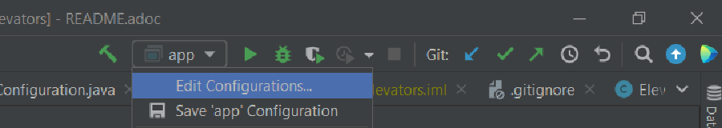

=== Clone repo :
[source,bash]
----
git clone https://github.com/mrn888/JavaElevators.git
----
Then open folder *_JavaElevators_* as IdeaProject

Use 11 JDK

=== Download the JavaFx SDK here :
https://download2.gluonhq.com/openjfx/17.0.1/openjfx-17.0.1_windows-x64_bin-sdk.zip

Configure project to use SDK :

image::img/setJavaFxSDK.png[]

=== Run app :
Go to com.nupl.ui.Main and run the Main

It will fail, go to edit configuration

Set VM Options to
[source,bash]
----
--module-path pathToJavaFxSDK\JavaFx\javafx-sdk-17.0.1\lib --add-modules=javafx.controls,javafx.fxml
----
image::img/setVmOptions.png[]